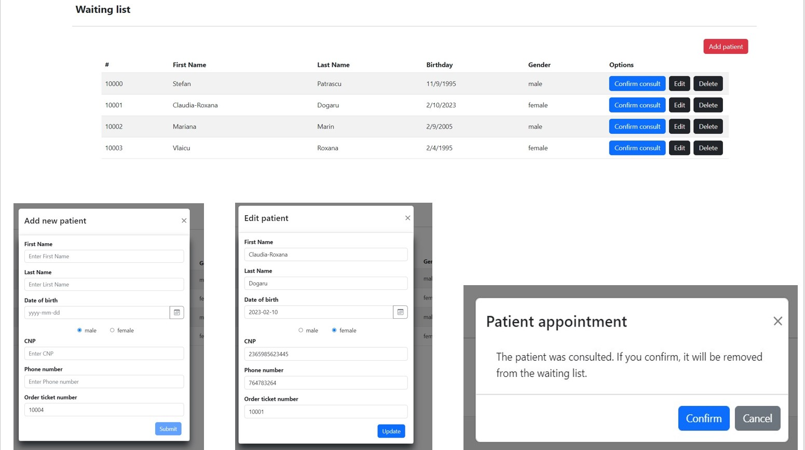

# Medical Appointments Application

The MedicalAppointmentsApp is an app for managing patients presenting to a doctor's office for consultation. The main page displays patients on the waiting list from where you can add a new patient and delete/edit an existing one. You can also remove a patient from a new view, after it was consulted. 

For the add and edit patient form the following validations have been added for fields as follows:

⁃ Required fields: Last Name, First Name, Date of Birth, Gender

⁃ Date of Birth must be less than the current date

⁃ Gender will have two options: M and F

⁃ The National ID must contain 13 numeric characters

⁃ Phone number must contain only numeric characters

⁃ Order number will be disabled and will be auto-generated according to
the numbers already in the list

The implementation was made with Angular Reactive forms.

# Project was based on the following technologies and tooling:
- [Angular CLI](https://github.com/angular/angular-cli) version 14.1.3 with Typescript

- HTML

- SASS 

- JSON Server - REST API backend

- Git

- Visual Studio Code

- NG-Bootstrap

Libraries:

- Bootstrap

# To execute the application, the following steps must be performed:
- Install the json-server package globally using the npm package manager by executing the command: **npm install -g json-server**

- Start the json-server by executing the command: **json-server --watch db.json**, which will read and serve the data from the specified db.json file.

# ESLint and Prettier configuration files 

In order to have a common style code for Medical Appointments Application, in Visual Studio Code i used 2 extensions: ESLint and Prettier with their own configuration files :

•	**.prettierrc**

  with .prettierignore

•	**.eslintrc.json** 

 This extensions require the following NPM packages to be installed: **prettier**, **eslint**.

 Select the default formatting extension as follows: Right-click in editor > "Format Document With" > "Configure Default Formatter" > "Prettier - Code Formatter". 

 The step must be done for all file types (HTML, SCSS, TS, JSON) because there is a different default formatter for each extension. It must be Prettier everywhere.

 From now on ESLint should highlight code errors with yellow or red, and when saving a file Prettier should auto-format the code.

 In order to format all files between a project you must install globally Prettier:
**npm i prettier -g**

 And then run the command:
**prettier --config .prettierrc --write .**

## Development server

Run `ng serve` for a dev server. Navigate to `http://localhost:4200/`. The application will automatically reload if you change any of the source files.

## Code scaffolding

Run `ng generate component component-name` to generate a new component. You can also use `ng generate directive|pipe|service|class|guard|interface|enum|module`.

## Build

Run `ng build` to build the project. The build artifacts will be stored in the `dist/` directory.

## Running unit tests

Run `ng test` to execute the unit tests via [Karma](https://karma-runner.github.io).

## Running end-to-end tests

Run `ng e2e` to execute the end-to-end tests via a platform of your choice. To use this command, you need to first add a package that implements end-to-end testing capabilities.

## Further help

To get more help on the Angular CLI use `ng help` or go check out the [Angular CLI Overview and Command Reference](https://angular.io/cli) page.
